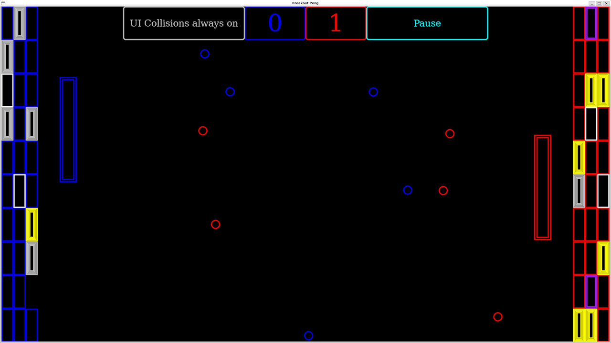
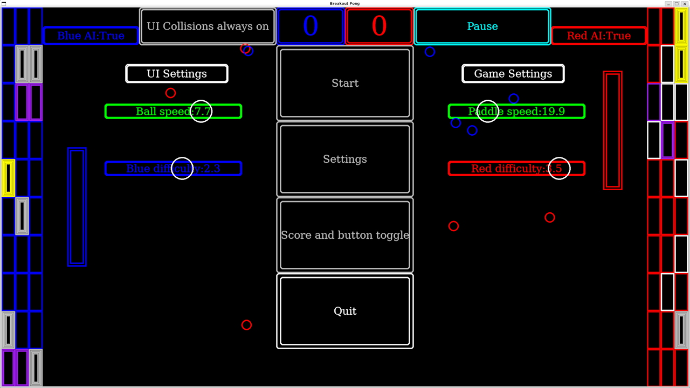

<div align="center">
    <div>
        <h2>"Breakout and Pong"</h2>
        <em>made in pygame for <a href="https://boot.dev">boot.dev</a> personal project</em>
        <h4>literally just a mashup of pong and breakout</h4>
    </div>
    <div>
        
    </div>
    <div>
        
    </div>
</div>

## Play

Download the latest `.exe` from [Releases](../../releases), or run from source (below).

## Controls
| Action | Key |
| --- | --- |
| Left paddle up / down | W / S |
| Right paddle up / down | I / K |
| Pause / resume | Esc |
| Reset to menu | Space |
| Click buttons / drag sliders | Mouse |

## Install
Requires Python 3.10+ and Pygame 2.6.1+
```
git clone <your-repo-url> 
cd breakout-pong 
uv sync 
uv run python main.py
```